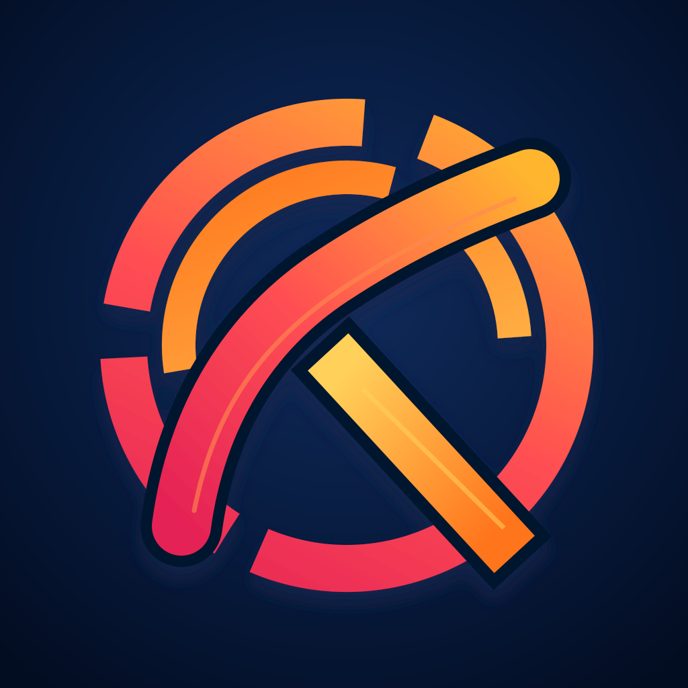
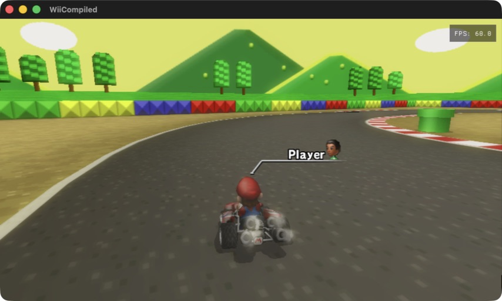
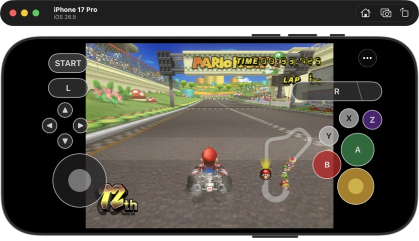
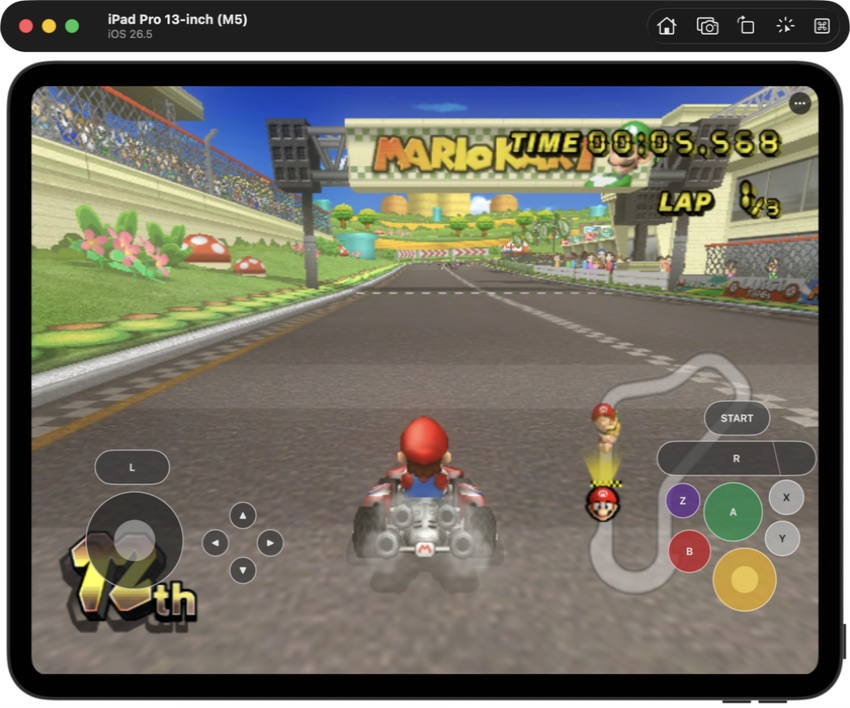

# KartPad

<p align="center">
  <strong>Mario Kart Wii on Apple Silicon Mac, iPhone, and iPad through static recompilation and Metal.</strong><br>
  Native macOS gameplay plus touch-first iPhone and iPad development builds using private user-supplied game data.
</p>

<p align="center">
  
</p>

<p align="center">
  
  
  
  
  
  
</p>



KartPad packages a native Apple ARM64 app around a
[WiiCompiled](https://github.com/sonicdcer/WiiCompiled)-generated Mario Kart Wii
module and its Aurora/Dawn compatibility runtime. PowerPC game code runs as
ahead-of-time translated arm64 code, Dawn presents through Metal, and a narrow
Apple host layer supplies audio, input, storage, timing, and lifecycle behavior.

This repository contains KartPad's Apple integration, reproducible patches,
tests, documentation, and original artwork. It does **not** contain Mario Kart
Wii, a disc image, extracted Nintendo assets, generated game code, saves, or
signing material.

## Current status

| Area | Current result |
|---|---|
| macOS runtime | Native arm64 title, menus, races, saves, ghosts, Battle, and split-screen gameplay through Metal |
| Track coverage | All 32 retail tracks have exact native completion evidence |
| Correctness | Darwin memory, scheduler, ABI, integer, scalar-FP, and paired-single gates pass against their defined oracles |
| Input | Keyboard plus four independent Classic-controller slots; two-player full-race evidence passes |
| Audio | Non-silent host playback, pause/resume, live output-device migration, and a two-hour representative continuity run pass their instrumented subcases; subjective listening and the eight-hour soak remain open |
| Performance | Warm, simple scenes can report 60 FPS; first-use shader compilation and some tracks can fall far below real time. Stable frame pacing is **not yet accepted** |
| Packaging | The original icon and exact branded 80 MiB package pass audit, installed-storage, configured gameplay, save-preservation, and normal-close checks; the native first-run/settings/data-management shell remains open |
| iPhone/iPad | The full 29,065-function arm64 retail app boots, reaches live races, imports private extracted data, preserves saves, and resumes on iPhone and iPad Simulator; the same exact source graph also builds and audits as a full unsigned physical-iOS app with the exact SunPad touch/menu source |
| Distribution | Development source only; no game data and no release candidate |

The evidence ledger, exact open rows, and known risks live in
[`docs/STATUS.md`](docs/STATUS.md). The 67-row release matrix is in
[`docs/PRD.md`](docs/PRD.md); a successful compile or screenshot is never
treated as gameplay acceptance by itself.

### Performance is active work

KartPad is playable on Apple Silicon, but it is not yet performance-ready.
The bundled initial pipeline cache reduces compilation work without eliminating
it. A cold title sequence has recovered from roughly 44 FPS to 60 FPS while
hundreds of shaders finished compiling; Moonview Highway has fallen to 1.3 FPS
on first use and later recovered only to roughly 46–54 FPS. Audio telemetry has
also recorded bounded drops during heavy compilation.

A matched title-path test makes that cache boundary concrete: from empty cache,
minimum effective FPS was 51.958 with an 83.783 ms maximum p99 and 20 dropped
audio blocks; the immediate warm relaunch held at least 59.963 effective FPS
with a 17.264 ms maximum p99 and zero drops. Track-level cold/warm profiling is
still required.

Those numbers are observations, not promises. The current performance gate is
a controlled cold-cache/warm-cache comparison with frame-time percentiles,
shader-cache accounting, audio-drop accounting, representative races, and a
long soak. Until it passes, expect startup hitches, track-dependent slowdown,
and poorer performance on iPhone than on Mac or iPad-class hardware.

## Game data

KartPad never downloads or bundles Nintendo data. Development uses a locally
owned PAL `RMCP01` revision 0 image that is verified, kept read-only, and
ignored by Git. Extracted files, translations, caches, saves, logs, and private
captures stay in ignored local directories.

On iPhone and iPad, first launch stops before emulation and asks for an
extracted `RMCP01` `DATA` folder. KartPad validates the disc identity and
runtime-critical files, copies the 2.5 GiB tree into private Application
Support with iOS data protection, excludes it from backup, and atomically
activates it. Interrupted imports recover or roll back; replacement never
silently discards the last valid copy. Removal is explicit, undoable until
relaunch, and occurs before emulation while preserving saves.

The translated ARM64 graph is compiled and signed on the Mac. The mobile app
imports non-executable game data only; it contains no PowerPC JIT, runtime
compiler, or executable-code download.

| Game ID | Region | Revision | Accepted input |
|---|---|---|---|
| `RMCP01` | PAL / Europe | 0 | One exact pinned WBFS container for the current development profile |

Other regions, revisions, dumps, and container hashes fail closed even when
their filename extension is recognized. The expected digest is recorded in
the build scripts for identification; no disc content is tracked or
distributed.

## Build from source

You need:

- an Apple Silicon Mac running macOS 14 or newer;
- Xcode and its command-line tools;
- CMake, Ninja, Git, ripgrep, Python 3, the .NET 8 SDK, and Rust/Cargo;
- `nodtool` 2.0.0-alpha.9; and
- your own legally obtained supported Mario Kart Wii `RMCP01` revision 0 image.

Install the pinned extractor if it is not already available:

```sh
cargo install nodtool --version 2.0.0-alpha.9 --locked
```

Verify the pinned public sources and private input boundary:

```sh
./scripts/verify-sources.sh
./scripts/check-repo-safety.sh
```

Run the portable correctness gates:

```sh
./scripts/test-host-portability.sh
./scripts/test-guest-memory.sh
./scripts/test-guest-scheduler.sh
./scripts/test-ppc-semantics.sh
```

Build from the pinned supported image in one fail-closed local workflow:

```sh
./scripts/self-build-macos.sh /path/to/your/Mario-Kart-Wii.wbfs
```

The workflow verifies the complete supported image hash, extracts it read-only
with pinned `nodtool`, validates `RMCP01` revision 0 plus the DOL/REL hashes,
translates the full private title graph with bounded parallelism, builds the
patched Apple runtime, and audits the signed local app. All extracted and
translated outputs stay under ignored `private/`; the app stays under ignored
`build/`. Existing valid extraction/translation work can be resumed.

The initial translation and native build are substantial. The workflow reuses
validated extraction and translation outputs after an interruption. It does
not yet clone every pinned reference automatically; the source references
checked by `verify-sources.sh` must already be present and clean.

Launch the audited local app:

```sh
open build/KartPad-self-built.app
```

The resulting app is a local development build. It is ignored by Git, may
contain a locally generated executable game module, and must not be
distributed.

To build from an already produced ignored translation graph, run the lower
level steps directly:

```sh
./scripts/prepare-g7-game-runtime.sh
./scripts/package-macos-runtime.sh \
  "$PWD/build/g7-game-runtime-build" \
  "$PWD/build/KartPad.app"
./scripts/audit-macos-package.sh "$PWD/build/KartPad.app"
```

Prepare and build the complete iOS Simulator runtime from the same private
translation graph:

```sh
./scripts/prepare-ios-game-runtime.sh \
  private/g8-full-translation \
  build/ios-game-runtime-source \
  build/ios-game-runtime-build
./scripts/build-ios-game-app.sh \
  build/ios-game-runtime-source \
  build/ios-game-app-xcode \
  private/g8-full-translation
```

The build scripts verify the exact SunPad source snapshot and dependency pins,
compile only ARM64 code, and fail if private game data, saves, signing material,
or non-system dynamic dependencies enter the app bundle. Installation and
signing remain local development steps; this repository does not publish a
playable app artifact.

See [`docs/GOAL-LOOP.md`](docs/GOAL-LOOP.md) for the execution rules and
[`docs/JOURNAL.md`](docs/JOURNAL.md) for reproducible commands and dated
results.

## First launch on Mac

The one-command build has already prepared the supported private data tree.
Open `KartPad-self-built.app`; if the app asks for game data, choose the
extracted `RMCP01` folder containing `sys/` and `files/`. KartPad validates the
identity before starting the runtime and preserves the previous valid setting
if a replacement is rejected.

The **KartPad** application menu provides **Choose Game Data…**, **Show Game
Data**, **Show Cache**, **Save Diagnostics Report…**, **Controller Settings…**,
**Controls…**, and the standard **Settings…** and **Quit** actions. Settings
exposes the supported display, audio, and FPS-counter controls. Durable saves
and configuration live in `~/Library/Application Support/KartPad`;
regenerable graphics data lives in `~/Library/Caches/KartPad`.

## Controls and mobile direction

The macOS keyboard bridge maps `WASD` to steering, `U`/Return to
A/accelerate/confirm, `M`/Delete to B/brake/reverse/back, `E` to R/drift,
Left Shift to L/item, arrows to the D-pad/tricks, Space to Start/pause, and Tab
to Select/minus. The native **Controls…** panel (`Command-/`) keeps the full
mapping visible in the app. Native controller discovery, remapping, and four
stable local slots are implemented separately from the keyboard fallback.

The iPhone/iPad app compiles a byte-identical pinned snapshot of SunPad's GPLv3
touch-control component and persistent **•••** menu directly. It preserves the
component's independently editable phone/tablet layouts, safe-area treatment,
multitouch, accessibility labels, settings, diagnostics, and controller-handoff
behavior. A separate tested adapter supplies Mario Kart Wii's Classic Controller
ABI without changing the copied baseline.

The landscape touch surface keeps every Wii Classic Controller action
available without a separate controller:

- **Left:** steering stick, D-pad, L, Start, and Select within thumb reach.
- **Right:** action buttons, R/ZL/ZR, and a second stick for menu-compatible
  input.
- **Mario Kart shoulders:** R is a compact digital control matching L rather
  than SunPad's Sunshine-specific analog-pressure trigger.
- **Held acceleration:** A stays asserted for the full touch. After one
  uninterrupted second it turns cyan and adds light haptic feedback, then
  returns to green and releases acceleration when the finger lifts.
- **Customize:** move and resize controls independently, save separate phone
  and tablet arrangements, or reset to the exact default layout.
- **Controller handoff:** touch stays Player 1; connected extended controllers
  receive stable Player 1–4 slots and stale input is released on disconnect.
- **Menu:** the persistent **•••** opens display, controls, game data,
  diagnostics, multiplayer access, and motion steering.

KartPad's owning layer adds two actions ahead of SunPad's unchanged menu:

- **Multiplayer…** reports connected controllers, stable Player 1–4 assignment,
  and opens controller setup guidance. Players 2–4 publish independent retail
  KPAD channels while touch remains Player 1.
- **Motion Steering…** is default-off and provides recenter, inversion, and
  0.5×/1×/2× sensitivity. Touch can override it, physical controllers take
  priority, and backgrounding clears the live motion state.

The full retail graph boots on iPhone 17 Pro and iPad Pro 13-inch Simulator,
reaches title/menu/live Luigi Circuit, survives background/foreground, and
preserves exact save hashes across relaunch. The original icon catalog, privacy
manifest, opaque fitted-output bands, package boundary, and full 29,065-function
unsigned physical-device build pass. Simulator motion sensors are unavailable by design;
physical motion feel, complete touch/motion races, physical controller handoff,
and physical-device performance/audio remain hands-on gates.

## First launch on iPhone or iPad

KartPad does not include Mario Kart Wii and cannot compile game code on-device.
For a locally built development app:

1. Prepare the supported private translation and extracted `RMCP01` data on the
   Mac from your own disc image.
2. Put the extracted `DATA` folder in Files, or choose it from another Files
   provider when KartPad asks for game data.
3. Launch KartPad and choose **Choose Extracted DATA Folder…**.
4. Leave the app open while it validates, protects, stages, and activates the
   copy. A successful first import continues into the game in the same session.
5. Later, use **••• → Game Data & Saves** to reimport or schedule removal.

Saves live separately from the extracted game-data tree. Reimport and removal
retain them; uninstalling the app still removes its whole Apple container.

## Mobile screenshots

<table>
  <tr>
    <td width="50%"></td>
    <td width="50%"></td>
  </tr>
  <tr>
    <td align="center"><strong>iPhone retail runtime</strong><br>Metal gameplay with the exact SunPad touch surface.</td>
    <td align="center"><strong>iPad retail runtime</strong><br>The independent tablet layout scales across the larger safe area.</td>
  </tr>
</table>

These are Simulator development-build captures using game data supplied
privately by the device owner. No game image, extracted data, save, or playable
binary is part of this repository.

## Diagnostics and privacy

On Mac, choose **KartPad → Save Diagnostics Report…** after a failure or slow
session. The schema-3 report contains bounded build/runtime identifiers,
selected safe settings, storage health, clean-versus-unclean shutdown state,
and capped current/previous log tails. User-directory prefixes and usernames
are redacted. It excludes the disc image, extracted files, generated game
module, saves, and file contents.

On iPhone or iPad, use **••• → Report a Problem…** to create the inherited
bounded SunPad-format report and review it before sharing. Never attach game
data, generated modules, saves, signing material, or a complete app container
to a public report.

## Evidence-first development

KartPad keeps publishable, content-safe evidence under `docs/artifacts/` and
private traces under ignored paths. Every accepted step records the candidate,
procedure, observed result, hashes, limitations, and next gate. The project
does not infer timing, audio quality, touch feel, or stability from source
inspection alone.

Useful starting points:

- [`docs/STATUS.md`](docs/STATUS.md) — current accepted state and open risks.
- [`docs/PRD.md`](docs/PRD.md) — product requirements and release matrix.
- [`docs/PORTABILITY.md`](docs/PORTABILITY.md) — Windows-to-Apple host boundary.
- [`docs/SEMANTICS.md`](docs/SEMANTICS.md) — PPC/AArch64 correctness evidence.
- [`docs/RELEASE-CHECKLIST.md`](docs/RELEASE-CHECKLIST.md) — release gates.

## Frequently asked questions

### Does this repository include Mario Kart Wii?

No. You must supply your own legally obtained supported disc image. Do not
open issues requesting game data, extracted files, generated modules, or
download links.

### Is KartPad a general Wii emulator?

No. KartPad is a game-specific static-recompilation integration for one pinned
Mario Kart Wii profile. It is not a loader for arbitrary Wii software.

### Does KartPad use a PowerPC JIT on iPhone or iPad?

No. The mobile app executes a Mac-generated ARM64 translation and does not
download executable code or compile PowerPC code on-device.

### Why is the frame rate slow on first use?

Dawn and Metal still compile pipelines that are absent from the initial cache.
That work can stall guest progress and pressure the audio queue. Cache
coverage, bounded compilation, and sustained frame pacing are active release
gates; a displayed 60 FPS counter in one scene is not treated as acceptance.

### Do the inherited experimental modes speed up KartPad?

No. Those visually retained SunPad menu rows target Sunshine-specific runtime
features: a 90% emulated CPU clock and a GMSE01 60 FPS patch. KartPad explains
that they are unavailable and does not persist either preference. Use 1x
render resolution while diagnosing performance; KartPad's actual work is
tracked through frame-time telemetry, real guest-clock cadence, and CPU/GPU
profiles rather than an incompatible switch.

### Can I download a playable app?

No public playable artifact is distributed. The repository currently provides
development source and a local, audited macOS self-build path. A legal release
also needs reproducible fresh-clone provisioning, final license/notice review,
signing, notarization, update infrastructure, and the remaining performance
and physical-device gates.

### Do saves survive an app update or game-data replacement?

The tested in-place paths keep saves separate from game data, and reimport or
scheduled removal preserves them. A clean uninstall, bundle-identifier change,
or incompatible signing change can still remove or disconnect the app
container, so back up before crossing those boundaries.

### Is everything finished?

No. Native macOS gameplay is broad and the Simulator mobile build runs real
races, but sustained performance, a complete three- and four-player result
path, the eight-hour soak, native WBFS import UI, fresh-clone provisioning,
online play, complete touch/motion races, physical-device acceptance, and the
full release matrix remain open.

## Project map

| Path | Purpose |
|---|---|
| [`scripts/self-build-macos.sh`](scripts/self-build-macos.sh) | Verify, extract, translate, build, sign, and audit a local macOS app |
| [`scripts/prepare-disc.sh`](scripts/prepare-disc.sh) | Validate and privately extract the supported disc profile |
| [`scripts/translate-base.sh`](scripts/translate-base.sh) | Produce the ignored full ARM64 translation graph |
| [`scripts/build-ios-game-app.sh`](scripts/build-ios-game-app.sh) | Build the full iPhone/iPad Simulator game app |
| [`scripts/build-ios-device-game-app.sh`](scripts/build-ios-device-game-app.sh) | Build and audit the full unsigned physical-iPhone/iPad game app |
| [`scripts/check-ios-device-runtime-host.sh`](scripts/check-ios-device-runtime-host.sh) | Compile the exact UIKit runtime host for physical iOS and reject Simulator-only hooks |
| [`scripts/audit-macos-package.sh`](scripts/audit-macos-package.sh) | Reject malformed or privacy-unsafe Mac packages |
| [`scripts/audit-ios-game-app.sh`](scripts/audit-ios-game-app.sh) | Reject private data, unsafe linkage, and incomplete iOS bundles |
| [`apple/macos/`](apple/macos/) | Native Mac shell, settings, diagnostics, and runtime integration |
| [`apple/ios/`](apple/ios/) | iPhone/iPad lifecycle, import, multiplayer, and motion integration |
| [`apple/third_party/sunpad/`](apple/third_party/sunpad/) | Exact pinned SunPad touch/menu snapshot and provenance |
| [`patches/`](patches/) | Reproducible WiiCompiled/Aurora/Dawn integration changes |
| [`docs/STATUS.md`](docs/STATUS.md) | Accepted evidence, current risks, and honest open work |
| [`docs/PERF.md`](docs/PERF.md) | Performance measurement contract and acceptance gates |
| [`docs/KNOWN-ISSUES.md`](docs/KNOWN-ISSUES.md) | Known limitations and current workarounds |
| `ref/`, `private/`, `build/` | Ignored reference checkouts, private inputs, and local outputs |

## Research and credits

KartPad builds on WiiCompiled and its Aurora/Dawn runtime, Dolphin-derived
hardware research, SDL, and the wider static-recompilation community. SunPad
is the direct source—not merely a visual inspiration—for the mobile touch
surface and persistent three-dot menu. Exact pins and provenance live in the
repository verification scripts, the SunPad snapshot record, and the project
documentation.

## Legal and provenance

Mario Kart, Wii, Nintendo, and game imagery are owned by their respective
rights holders and are used here only to identify compatibility and document
runtime behavior. KartPad is not affiliated with or endorsed by Nintendo.

WiiCompiled is GPLv3 at the pinned revision. Aurora, Dawn, SDL, Dolphin-derived
code, Crypto++, Abseil, FreeType, libpng, and other dependencies retain their
own licenses and notice obligations. The imported SunPad mobile UI snapshot
retains its GPLv3 license, exact upstream revision, hashes, and attribution.
KartPad's original icon provenance is recorded in
[`branding/PROVENANCE.md`](branding/PROVENANCE.md).

## Contributing

The most useful contributions are reproducible reports against an open row in
[`docs/RELEASE-CHECKLIST.md`](docs/RELEASE-CHECKLIST.md), especially cold/warm
performance captures and physical-device touch, motion, controller, audio, and
lifecycle results. Include the exact commit, hardware, OS, settings, procedure,
and observed result. Never attach private game data, generated game code,
saves, credentials, or signing material to an issue or pull request.
