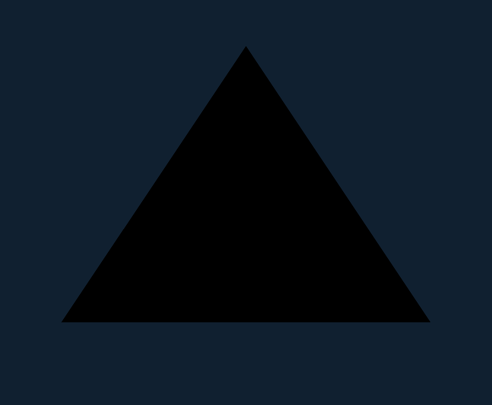

# G7 translated GX frame through Aurora/Dawn Metal

Status: **translated-GX fixture acceptance evidence**. Host and translated fixtures pass; G7 remains in progress until the first game frame presents.

- Guest input: a generated no-game-data PowerPC DOL translated by the pinned WiiCompiled translator.
- Translated function: `func_80001000`, exact regeneration checked before every run.
- Command boundary: 64-byte `KPGX` payload in checked guest memory at `0x80010000`.
- Payload: `#102030ff` clear plus three PowerPC-authored XYZ vertices describing a black triangle.
- Renderer: Dolphin GX calls -> Aurora GX FIFO/command processor/shader -> Dawn Metal -> SDL3 Cocoa surface.
- GPU readback: Aurora frame capture at frame 8, 1164x960 Retina EFB.
- Validation: first/final background pixels exact BGRA `30 20 10 ff`; center triangle pixel exact BGRA `00 00 00 ff`.
- BMP SHA-256: `799af319cb7bdbbc3ce6371b00d3dad1a5c47a8a14c6108f2271b0210777477e`.
- PNG SHA-256: `5e2f6da2d9e38a3cea6bbf6b8f846c7381d3c566c9ac99505aa1bb0a071a7507`.
- Reproduction: `./scripts/test-g7-aurora-translated-gx.sh`.

The fixture rejects a stale generated translation, non-Metal backend, invalid command header, empty/dimensionless capture, wrong background, or missing center geometry.

