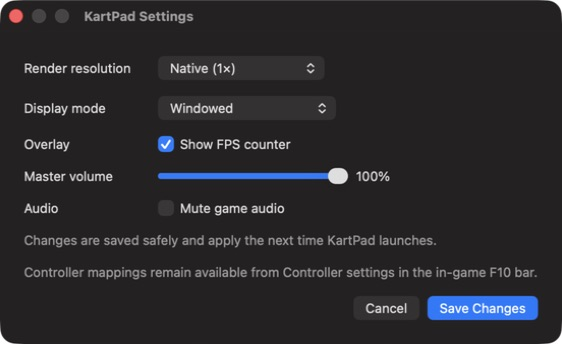

# G13 native macOS settings checkpoint

Status: **Pass for native display/audio settings persistence; G13 remains in
progress.**

## Exact candidate

- Source: `bed127fa4fed930cd730a858e870d20fa646378e`
- Generated package: `build/KartPad-packaged-bed127f.app` (ignored)
- Unsigned runtime SHA-256:
  `6ceaeca2e7604926ca3290d78c97650d684ef76f210631cecb495c904848f642`
- Signed executable SHA-256:
  `3519452c6b03d505d1249c99e71f50f912e5bf5d4a4e952a6f6726ff70a0d0f9`
- Build-fingerprint SHA-256:
  `73e06e41a0ff5114f8ee58bacef816d9e4b13cab927da44487c77a2033a1cbb2`
- Bundle-content hash:
  `5b0a47b251b84c9698580c06a39c4e9e7adc1576ba120274cd8a46f95dfb1ed1`

## Exercise

The disabled SDL application-menu item is now a normal enabled `Settings…`
command. It opens a native AppKit panel with:

- render resolution: Auto, Native, 1.5×, 2×, 3×, or 4×;
- windowed, borderless-fullscreen, or exclusive-fullscreen output;
- FPS-counter visibility;
- master volume; and
- mute.

The panel states that changes apply on the next launch and points controller
mapping to the already functional in-game F10 controller settings. It writes
only the five corresponding TOML keys; existing comments, paths, and unrelated
settings remain intact.

The pre-commit functional regression selected 3×, borderless fullscreen, FPS
off, 75% master volume, and mute. The resulting private config retained the
existing game-data path. A second isolated portable launch logged and applied
all five values, including framebuffer scale 3 and host-audio gain 0. The live
user config was then restored byte-for-byte to SHA-256
`3560325ff1a4509c76c99eb4aefedfa7d92f307b340ee4f4c79f10d8ec13b173`.

The Cancel route left that hash unchanged. The Objective-C++ source passes
`-Wall -Wextra -Wpedantic -Werror`; the full runtime relink and strengthened
package audit pass. The exact post-commit package exposed the complete panel
through accessibility and closed normally. No Simulator was booted.

The screenshot SHA-256 is
`eda8a31f7a114e6a8c79c606db6fa169729e6a85fa460725361c44df9a9f5fb5`.

## Remaining boundary

This does not complete G13. Native first-run WBFS/extracted-data setup,
controller-mapping entry from the native shell, richer privacy-safe runtime
breadcrumbs, update-in-place, and clean-clone self-build/package verification
remain open.
