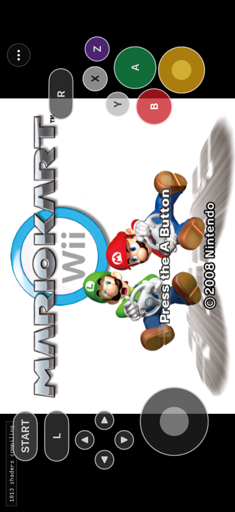

# Native mobile WBFS import acceptance

## Candidate

- Source: current `main` worktree immediately before the physical-acceptance
  checkpoint.
- Simulator app executable SHA-256:
  `ea72d42cf8652c79346063879235ad591211eb03a03d2efbb804f3699c141a88`
- Platform: arm64 `IOSSIMULATOR`, minimum iOS 16.0.
- Imported title profile: `RMCP01`, disc 0, revision 0.
- Unsigned physical-device executable SHA-256:
  `b02c1c94dee58526169a08e73bbbe671e6f6ee31c1870517ef244e2651e9de92`
  (`IOS`, minimum iOS 16.0).

## Procedure and result

1. Built pinned Dolphin DiscIO for iOS and linked only the narrow disc-image
   import archives into the translated KartPad app. The package links only
   Apple system libraries and contains no Dolphin JIT, cached-interpreter, or
   execution-core symbols.
2. Created one disposable iPhone Simulator and installed the audited app with
   no active game-data tree.
3. Placed a content-private APFS clone of the user's read-only supported WBFS
   in the app's Files-visible Documents directory.
4. Used the real first-launch picker action. KartPad opened the WBFS, extracted
   the complete tree into protected Application Support, validated it, and
   continued into the retail runtime in the same process.
5. The active tree contained 2,043 files and occupied roughly 2.5 GiB.
   `sys/main.dol` reproduced SHA-256
   `80d18895b39c63bd80f457398bfcbb91b7d16ac116a41a88967e954080155b05`;
   `files/rel/StaticR.rel` reproduced SHA-256
   `16d9d146112541fefea701ecb5bc1a496f9d50e4a752fbb5b6778e7c6399f67d`.
6. Retail rendering reached the Peach intro. Touch A published Classic button
   `0x00000010` and advanced the scene. A warm relaunch reached the Mario Kart
   Wii title with the exact SunPad touch surface.
7. The Simulator virtual controller was discovered as slot 1. Source/suite
   verification confirms the reference handoff policy; physical hide/restore
   feel remains the next hardware gate because the reference intentionally
   leaves touch visible for Simulator controllers.

The app and disposable Simulator were terminated and deleted after capture.
Zero Simulators remained booted, and the user's preserved Simulator data was
not modified.

The matching pinned DiscIO graph then compiled for `iphoneos`, and the complete
29,065-function unsigned device app built and passed the strengthened package,
private-data, system-linkage, icon, importer, and no-execution-core audits. It
was not signed, installed, or launched; physical acceptance is intentionally
the next gate.
